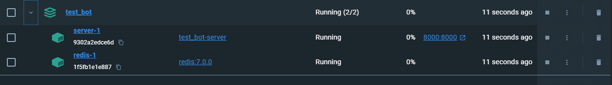
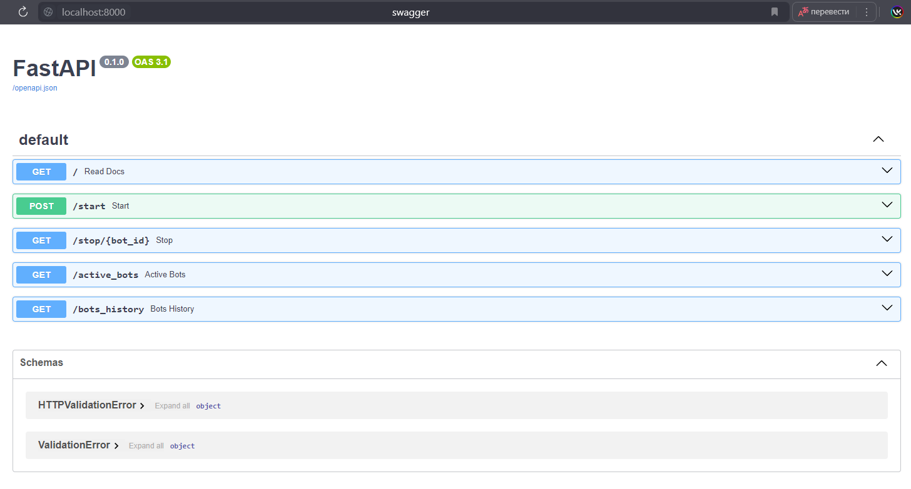
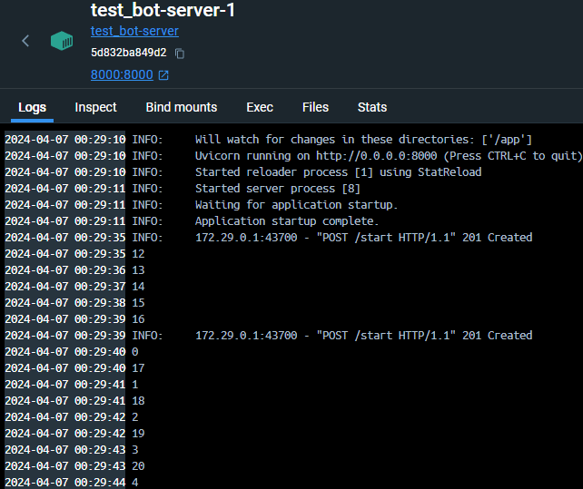
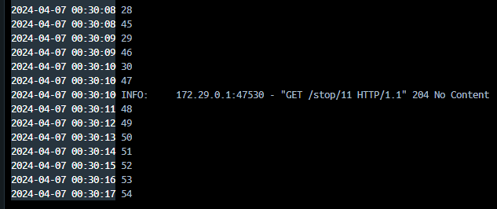

# Асинхронный python бот с управлением через Fast api Тестовое задание для Гринатом

Программа реализует упровление ботами через Fast Api сервер. При запуске бот каждую секунду пишет в консоль число, увеличивая его.
Боту можно передать число, с которого начать отсчёт. Пользователь может запустить бота, остановить бота, получить список активных ботов,
а также получить информацию об активности ботов из базы данных.

## Инструкция по размещению

Для размещения проекта необходим Docker. В корне проекта выполните команду:

```
docker-compose up
```

После создания контейнеров по порту 8000 будет доступен сервер Fast Api.



## Пример использования
По url http://localhost:8000/apidocs/ находится swagger. 



С помощью метода /start можно запускать новых ботов. В теле запроса опционально указывается число, с которого бот должен начать отсчёт.
В ответе видим id, который можно использовать для остановки бота.

```
curl -X 'POST' \
  'http://localhost:8000/start' \
  -H 'accept: application/json' \
  -H 'Content-Type: application/json' \
  -d '{
  "start_number": 12
}'

Ответ:
{
  "bot_id": 10
}


curl -X 'POST' 'http://localhost:8000/start' 

Ответ:
{
  "bot_id": 11
}

```

В логах контейнера server-1 можно увидеть, как боты оставляют записи.




С помощью метода /stop/{int} можно остановить работу бота, указав его id.
```
curl -X 'GET' 'http://localhost:8000/stop/11'
```
После обработки запроса сервером в логи продолжил писать другой оставшийся бот.



С помощью метода /bots_history можно получить историю запусков ботов из базы данных

```
curl -X 'GET' 'http://localhost:8000/bots_history'

Ответ:
[
  {
    "start_number": 12,
    "start": "2024-04-06T21:29:35.499784",
    "end": "still alive"
  },
  {
    "start_number": 0,
    "start": "2024-04-06T21:29:39.871568",
    "end": "2024-04-06T21:31:20.396328"
  }
]
```

## Использованный стэк

- Docker
- FastApi
- asyncio
- SQLite
- SQLAlchemy
- redis